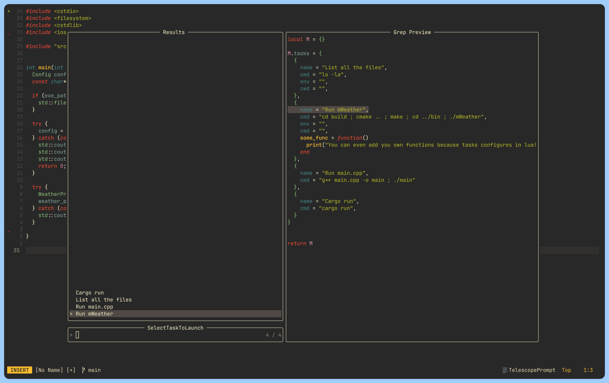

# 🥷 rittli.nvim

Revolutionary and Intuitive Terminal Tasks Launcher with tight telescope integration! 🔥




## ✨ Features
- 🔭 Create tasks in lua. Pick them using Telescope and launch in the *neovim* terminal
- 👀 Task preview in telescope
- 🤖 Tasks auto update (auto resource)
- ⚡️ Built-in Neovim terminal improvements (Toggle the last openned terminal)
- 🌎 Define local and global tasks
- 👻 Reuse global tasks as template for local tasks
- 🌟 Last tasks is rememberd for each directory
- 🔥 Create tasks dynamically! (My favorite use: Write all buffers before launch)
- 🧓 Cache the task if you want!
- 👖Wezterm integration!
- 🤯 Launch a task in the already existing terminal!

*You can see some features preview [here](/demo/gallery.md)*


## 🚀 Tutorial
### 0. Installation 🔴
1. Install the plugin using lazy.nvim plugin manager:

```lua
 {
   "miroshQa/rittli.nvim",
   lazy = true,
   dependencies = {
     'nvim-telescope/telescope.nvim'
   },
   keys = {
     { "<C-t>",     function() require("rittli.terminal_tweaks").toggle_last_openned_terminal() end, mode = { "n", "t" }},
     { "<Esc><Esc>", "<C-\\><C-n>", mode = "t" },
     { "<leader>r", function() require("rittli.core.telescope").tasks_picker() end, desc = "Pick the task" },
     { "<leader><leader>", function() require('telescope.builtin').buffers({path_display = {'tail'}, sort_mru = true, ignore_current_buffer = true}) end}
   },
   config = function()
     require("rittli").setup({})
   end,
 }
```

> [!NOTE]  
> - This tutorial is supposed to go through it step by step  
> - This tutorial assumes that you are using default opts and the suggested keymaps above


### 1. Create global tasks 🟡
1. Create "tasks" folder inside your user configuration directory in the "lua" folder.  
2. Create lua files what return lua table with the field "tasks", where your own tasks defined.

```lua
-- ~/.config/nvim/lua/tasks/some_tasks.lua 
local M = {}

M.tasks = {
  {
    name = "List all the files and print Hello!",
    builder = function() 
      local task = {
        cmd = {"ls -la", "echo $greeting"},
        env = {greeting = "Hello"}
      }

      return task
    end,
  },
  {
    name = "Build and Run current CPP or C file with Args",
    builder = function(cache)
      vim.cmd("wa")
      if vim.fn.isdirectory("build") == 0 then vim.fn.mkdir("build") end

      local task = {}
      local cur_file = vim.fn.expand("%")
      local bin_name = vim.fn.fnamemodify(cur_file, ":t:r")
      local compiler = vim.bo.filetype == "c" and "gcc" or "g++"
      if not cache.args then
        cache.args = vim.fn.input({prompt = "Enter exe arguments: "})
      end

      task.cmd = {
        string.format("%s %s -o build/%s", compiler, cur_file, bin_name),
        string.format("./build/%s %s", bin_name, cache.args)
      }
      return task
    end,
  }
}

return M

```

> [!NOTE]  
> - Global tasks will be available everywhere  
> - File loads and updates recursively. You can create other folders in "tasks" directory and create lua files with tasks there!  


### 2. Launch tasks 🟢
1. Press "leader + r" to open telescope tasks picker.
2. Select the desired task and launch it by pressing "Enter".

> [!NOTE]  
> - You can hide the terminal (opened on launch in new tab) and open again using "ctrl + t"  
> - You can close hide the terminal, simply type "exit" in the shell or press "ctrl + d"  
> - If you press "leader + r" again the previous running task will already be selected, just press enter to start it again!

### 3. Launch multiple tasks 💦
1. Hide the terminal with the task you have launched by pressing "ctrl + t.
2. Press "leader + r" again, pick a new task and launch.
3. Launch how many tasks as you want!

> [!NOTE]  
> - To open one of these opened and then hidden terminals, press "leader + leader", select the desired terminal and press "ctrl + t"  

### 4. Edit tasks 🔨
1. Open the Telescope tasks picker (press "leader + r") and select the desired task.      
2. Press "ctrl + t" to open a buffer with the task in a new tab and edit it
3. When you open Telescope tasks picker again, your tasks will be updated, and you will receive a notification about that

> [!NOTE]  
> - Tabs? Buffers? Windows? Wtf is that? If so, it is highly recommended to read [this](https://betterprogramming.pub/50-vim-mode-tips-for-ide-users-f7b525a794b3#:~:text=colorless%20diff%20command.-,67.%20Vim%20tabs,-It%20must%20be) (section 67) and watch [this](https://www.youtube.com/watch?v=_6OqJrdbfs0&t=221s) video

### 5. Create local tasks 👻
1. Create a folder in your current working directory named "tasks" and add lua files with tasks as usual

> [!NOTE]  
> - If the local task has the same name as global task, then the local task will override the global task (task from local directory will be used)

### 6. Reuse global tasks as template for local tasks 🔁
1. Open the Telescope tasks picker, select the task you want to reuse, and press "ctrl + r". This will clone the file containing this task into your local tasks folder (or create it if it doesn't exist yet) and open it in a new buffer
2. Edit newly cloned file as you want, add new tasks. When you open tasks picker again, all tasks from this file will be loaded!

### 7. Hide tasks in the telescope picker depending on the condition 👮
```lua
-- ~/.config/nvim/lua/tasks/rust.lua
local M = {}

-- You can define the "is_available" property for the whole module. All tasks will inherit it
M.is_available = function() return vim.fn.filereadable("Cargo.toml") == 1 end

M.tasks = {
  {
    name = "RUST: Cargo run",
    builder = function()
      vim.cmd("wa")
      return { cmd = {"cargo run"} }
    end,
  },
  {
    name = "C#: Dotnet run",
    -- You can also override the "is_available" for a specific task
    is_available = function() return vim.bo.filetype == "cs" end,
    builder = function()
      return {cmd = "dotnet run"}
    end,
  }
}

return M

```
### 8. Understand the stickiness of tasks 🫠
When you run a task for the first time, a terminal is created for it, after that the task begins to own this terminal until you destroy it

That means two things:
1. Every time you launch this task again, its commands will be sended to the terminal that the task owns without recreating it.
2. You cannot run one task in more than one terminal

> [!NOTE]  
> - The tasks even remain attached to the terminal after relaunching neovim! (This is especially useful if you run tasks in wezterm)

### 9. Try wezterm terminal provider instead neovim builtin terminal 👖
1. By default, tasks are started in a new tab in the neovim terminal. You can change this
```lua
  --- With this setting a terminal for tasks will be spawned by wezterm in the vertical split
config = function()
  require("rittli").setup({
      terminal_provider = require('rittli.core.terminal_providers.wezterm').CreateMasterLayoutProvider()
    })
end,
```

- To find out more about the available possible terminal providers, use auto-completion lsp hints
(you also need to have [lazydev](https://github.com/folke/lazydev.nvim) installed)
, or see the [source code](./lua/rittli/core/terminal_providers/)

### 10. Attach to the terminal instead creating new one! 🤝
1. As you may have noticed, starting a task for the first time creates a new terminal,
but what if you already have a terminal open and you want to launch the task in it?
To do this, open the task picker, select the task and press "ctrl + a". Select the desired terminal and press enter!

> [!NOTE]  
> - You have to understand that, you cannot attach a task to an existing terminal if the task has environment variables that need to be set


## ⚙️ Configuration
You can check the default configuration [here](./lua/rittli/config.lua). To override default options, simply pass new values in the opts table
```lua
config = function()
  require("rittli").setup({
    folder_name_with_tasks = "MyTasks",
    disable_resource_messages = true,
  })
end
```


## 🌻 Project Roadmap
- Tmux integration
- Better documentation and lua-ls type annotations
