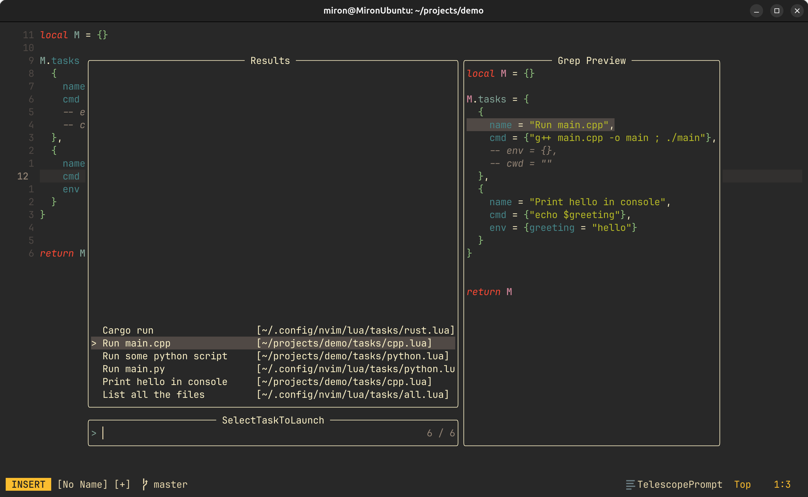
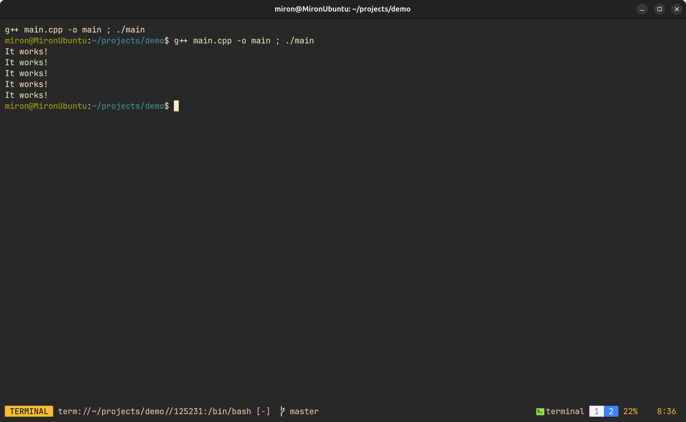
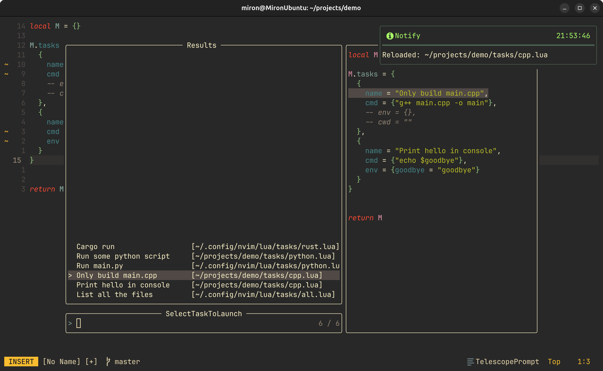

#🔥Features preview

## Pick the task using telescope with the task preview!

## Launch the task in the builtin neovim terminal. No other external dependencies!

## Run as many tasks as you want and select the one you need as a regular buffer!

## Change the tasks and they will update themselves without having to restart neovim!

